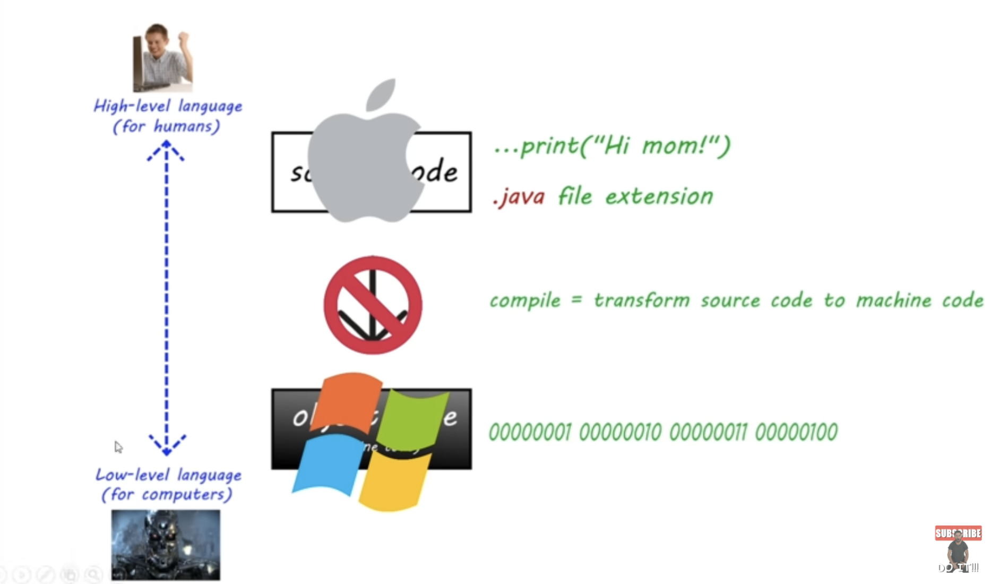

# lesson002. Java 的跨平台特性

在传统的编程语言中，如果你在某个操作系统（例如 macOS）上编写并编译代码，生成的可执行文件只能在该操作系统上运行。例如，在 macOS 上编译的代码只能运行在 macOS 上，而不能直接在 Windows 或其他操作系统上运行。这是因为编译器会将源代码直接转换为与特定操作系统和硬件相关的机器码。

然而，Java 通过 JVM（Java 虚拟机）解决了这个问题：

1. **跨平台性 (Cross-Platform)**：

- Java 通过将源代码编译为与操作系统无关的字节码（bytecode），实现了“编写一次，到处运行”的特性。
- 无论在 macOS、Windows 还是其他操作系统上编写和编译 Java 程序，生成的字节码都可以在任何安装了 JVM 的平台上运行。

2. **JVM 的作用**：

- 由于 JVM 的存在，字节码可以在不同平台上运行，而不需要重新编译。每个操作系统都有它自己的 JVM，负责将字节码转换为该系统的机器码。
- 这使得 Java 程序具有强大的可移植性和兼容性。因此，无论你在 macOS 还是 Windows 上编写和编译 Java 程序，生成的字节码都可以在其他操作系统上运行。

Java 通过将源代码编译为字节码，并通过 JVM 在不同平台上解释和执行字节码，实现了跨平台的特性。这个特性使得 Java 程序可以在多种操作系统上运行，而不需要为每个操作系统单独编译程序。
