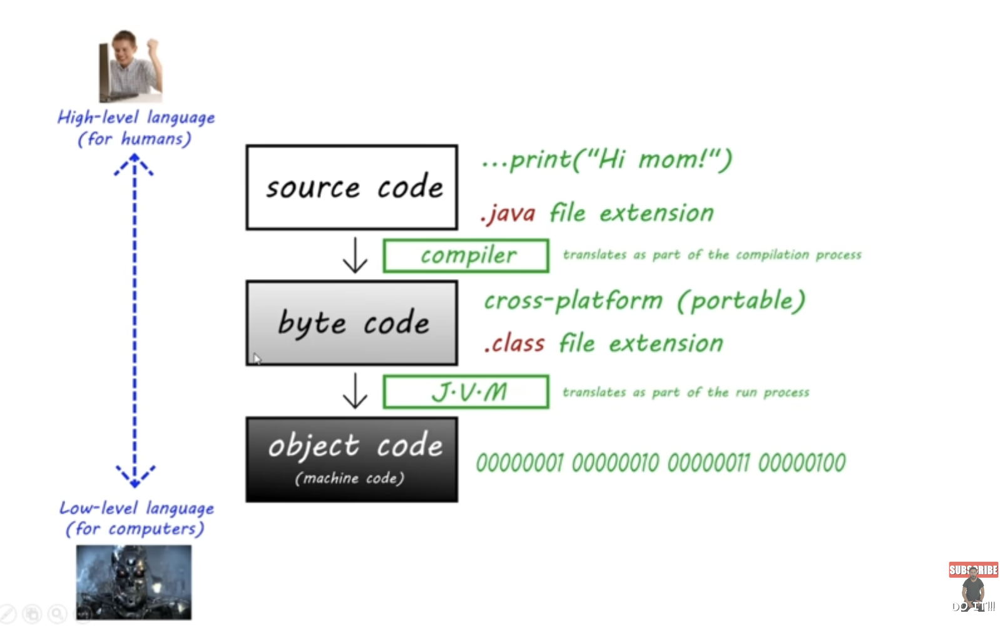
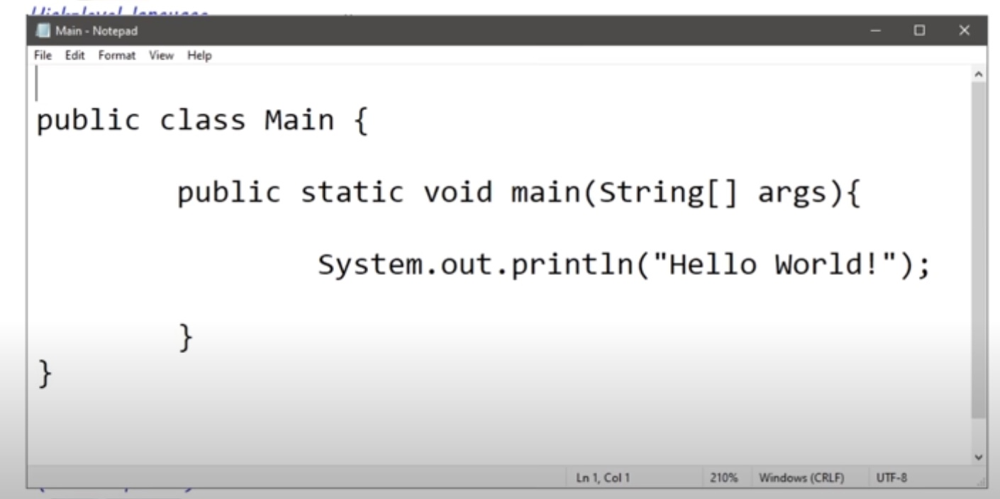
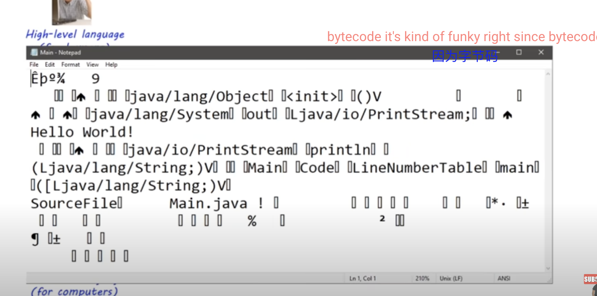

# lesson3. Java 编译与执行过程

Java 代码从源代码到最终执行的过程分为几个阶段：

1. **源代码 (Source Code)**：

- Java 的源代码是由开发者编写的高层次语言，通常以 `.java` 为文件扩展名。
- 例如，`System.out.println("Hi mom!")` 就是一个典型的 Java 源代码片段。
- 这种代码易于人类理解。

2. **编译 (Compilation)**：

- Java 编译器（`javac`）将 `.java` 文件中的源代码编译为字节码（byte code）。编译过程生成 `.class` 文件。
- 字节码是一种中间语言，具有跨平台的特性，可以在不同的操作系统上运行。

3. **字节码 (Byte Code)**：

- 编译后的 Java 字节码存储在 `.class` 文件中。
- 这种字节码不是直接运行在硬件上的机器码，而是由 JVM（Java 虚拟机）解释或编译后执行。

4. **Java 虚拟机 (JVM)**：

- JVM 是 Java 程序的运行环境，负责将字节码翻译为机器码来执行。
- JVM 的存在让 Java 具有良好的跨平台特性，因为 JVM 可以在任何操作系统上运行字节码，而无需重新编译源代码。

5. **目标代码 (Object Code / Machine Code)**：

- 最终，JVM 将字节码翻译为计算机能够识别的机器码（如二进制代码），然后由计算机的处理器执行。

6. **JDK 和 JVM**

- **JDK (Java Development Kit)**：JDK 是 Java 开发工具包，包含了开发 Java 程序所需的各种工具，包括编译器（`javac`）、JVM 和其他库。
- **JVM (Java Virtual Machine)**：JVM 是 JDK 的一部分，负责运行 Java 字节码。
