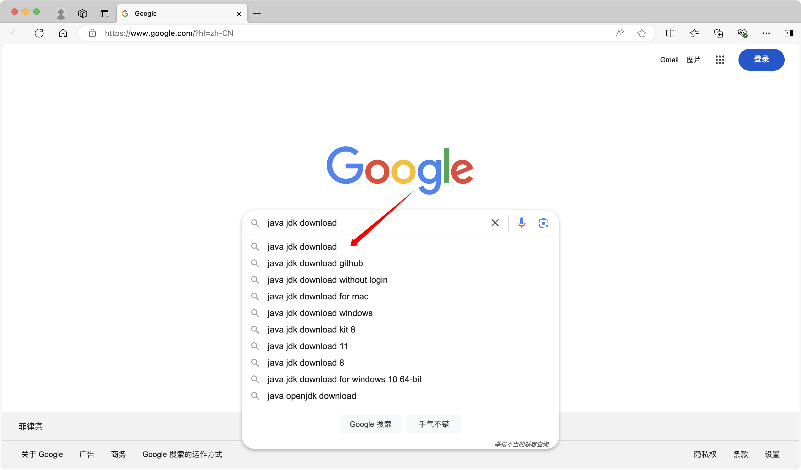
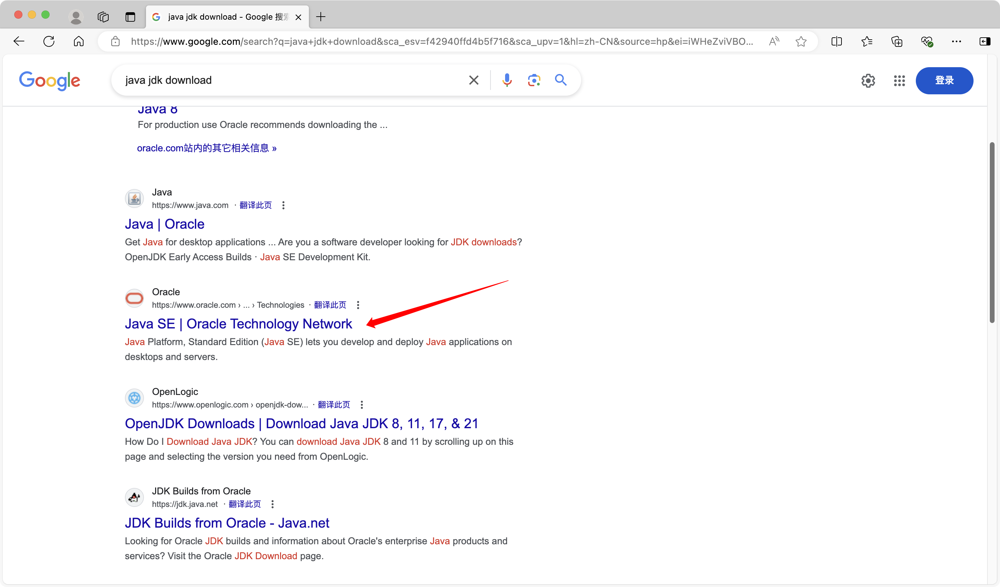
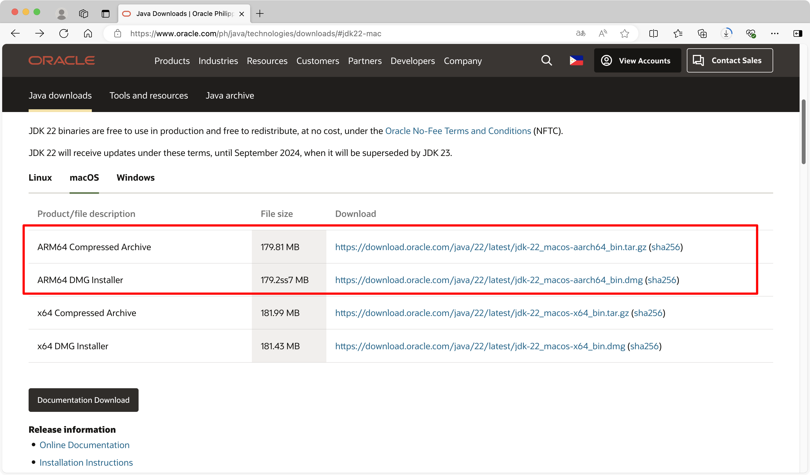

# lesson5. 下载并安装 Java JDK

为了开始学习和开发 Java 程序，首先需要下载和安装 Java 开发工具包 (JDK)。以下是步骤指南：

1. **搜索 Java JDK 下载**：

- 打开浏览器，进入 [Google.com](https://www.google.com)。
- 在搜索框中输入“java jdk download”，然后按下回车键。

2. **选择正确的下载链接**：

- 在搜索结果中，点击第一个链接，通常是指向 Oracle 官方网站的 “Java SE Downloads” 页面。这个页面会提供各种操作系统（如 Windows、macOS、Linux）下的 JDK 下载选项。

3. **选择适合的操作系统版本**：

- 根据你的操作系统（Windows, macOS 或 Linux），选择相应的 JDK 版本并下载。
- 对于 Windows 用户，选择“JDK for Windows”；对于 Mac 用户，选择“JDK for macOS”。

4. **安装 JDK**：

- 下载完成后，运行安装程序并按照提示完成 JDK 的安装。
- 安装完成后，JDK 将自动配置 Java 编译器和 JVM，使你能够编写和运行 Java 程序。

5. **配置环境变量（可选）**：

- 在某些操作系统上，可能需要手动配置环境变量，以确保 JDK 可以在命令行中运行。
- 常见的环境变量包括 `JAVA_HOME` 和 `PATH`，它们指向 JDK 的安装路径。

#### 总结

通过下载并安装 JDK，你将拥有编写和运行 Java 程序的完整开发环境。JDK 包含了所有必要的工具，包括 Java 编译器和 JVM，使你能够顺利开始 Java 学习和开发。