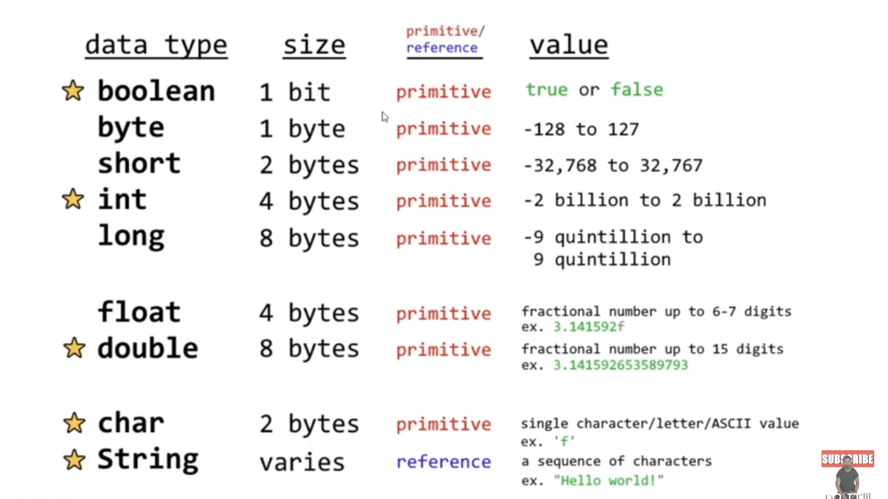

# lesson015. Java 数据类型

这是一个关于 Java **数据类型** 的表格，展示了每种数据类型的**大小**、**种类**（基本类型或引用类型）、以及它们可以存储的**值范围**。

### Java 数据类型分类：

1. **基本数据类型**（Primitive Types）：

- 存储的是实际的值，直接保存在变量中。

2. **引用数据类型**（Reference Types）：

- 存储的是对象的引用，而不是实际的值。

------

#### 基本数据类型

| 数据类型    | 大小    | 范围/示例值                                             | 类型     |
| ----------- | ------- | ------------------------------------------------------- | -------- |
| **boolean** | 1 bit   | `true` 或 `false`                                       | 基本类型 |
| **byte**    | 1 byte  | -128 到 127                                             | 基本类型 |
| **short**   | 2 bytes | -32,768 到 32,767                                       | 基本类型 |
| **int**     | 4 bytes | -2,147,483,648 到 2,147,483,647                         | 基本类型 |
| **long**    | 8 bytes | -9,223,372,036,854,775,808 到 9,223,372,036,854,775,807 | 基本类型 |
| **float**   | 4 bytes | 6-7 位有效数字的浮点数，如 `3.141592`                   | 基本类型 |
| **double**  | 8 bytes | 15 位有效数字的浮点数，如 `3.141592653589793`           | 基本类型 |
| **char**    | 2 bytes | 单个字符，如 `'f'`                                      | 基本类型 |

------

#### 引用数据类型

| 数据类型   | 大小       | 范围/示例值                   | 类型     |
| ---------- | ---------- | ----------------------------- | -------- |
| **String** | 取决于内容 | 字符串，例如 `"Hello world!"` | 引用类型 |

------

##### 说明：

1. **boolean**：表示布尔值，只有两个值：`true` 或 `false`。
2. **byte**：用于保存非常小的整数，范围从 -128 到 127。常用于节省空间，特别是在大数组中。
3. **short**：比 `byte` 大一些，范围从 -32,768 到 32,767。
4. **int**：最常用的整数类型，范围从 -231 到 231 - 1。
5. **long**：用于保存非常大的整数，范围从 -263 到 263 - 1。可以在数值后加上 `L`，例如 `100L`。
6. **float**：单精度浮点数，精度为 6-7 位有效数字。在浮点数后加上 `f`，例如 `3.14f`。
7. **double**：双精度浮点数，精度为 15 位有效数字。默认情况下，浮点数被认为是 `double` 类型。
8. **char**：用于表示单个字符，如 `'a'`、`'1'` 或特殊字符。
9. **String**：引用类型，表示一串字符，例如 `"Hello world!"`。

------

### 总结

- **基本数据类型** 用于存储简单的值，如整数、浮点数、字符和布尔值。
- **引用数据类型** 用于存储对象的内存地址，如 `String`、数组以及自定义类的实例。