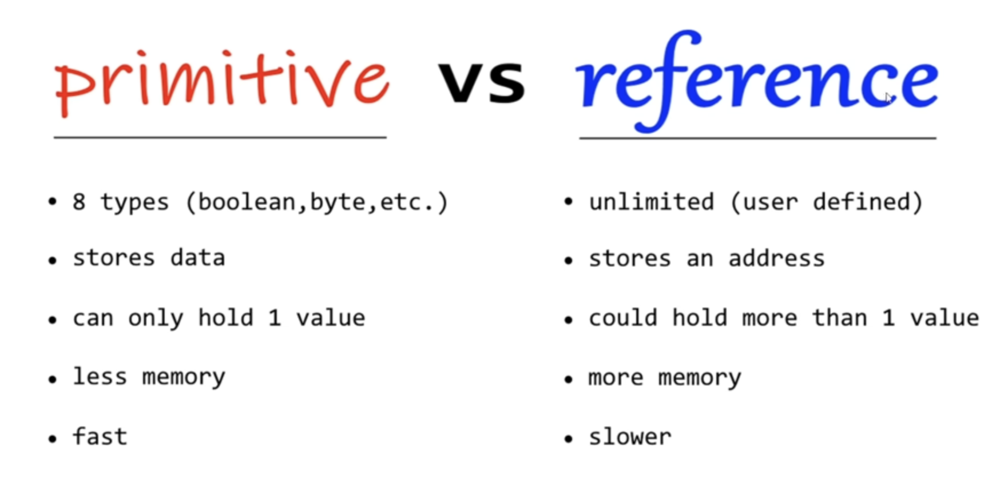

# lesson016. 基本数据类型与引用数据类型

这个图表展示了 **Java 中基本数据类型（primitive types）** 与 **引用数据类型（reference types）** 的对比。

### **基本数据类型 (Primitive Types)**

- **数量有限**：Java 中有 8 种基本数据类型：`boolean`、`byte`、`short`、`int`、`long`、`float`、`double`、`char`。
- **存储实际数据**：基本类型变量直接存储数据值。
- **只能保存一个值**：每个基本类型的变量只能保存一个值，比如 `int a = 5;` 只保存整数 `5`。
- **占用较少内存**：由于它们直接存储值，且类型有限，基本数据类型占用的内存比较小。
- **速度快**：处理基本类型比处理引用类型要快，因为它们直接存储在栈内存中，访问速度较快。

### **引用数据类型 (Reference Types)**

- **数量无限**：可以是用户自定义的类型，包括类、数组、接口等。常见的引用类型有 `String`、`Array`、对象等。
- **存储地址**：引用类型变量存储的是对象在堆内存中的地址，而不是实际的数据值。
- **可以保存多个值**：引用类型的对象可以包含多个属性或元素，如对象、数组等。
- **占用较多内存**：引用类型的对象通常更加复杂，占用的内存更多，因为不仅要存储对象，还要存储它们的地址信息。
- **速度较慢**：由于引用类型存储的是内存地址，访问它们时需要先找到地址然后再访问数据，速度比基本类型稍慢。

------

### 总结：

- **基本数据类型** 是 **固定的、简单的** 数据类型，存储在栈内存中，处理速度快，适合存储单一的值。
- **引用数据类型** 可以是 **复杂的、自定义的** 数据类型，存储在堆内存中，适合存储多个值或更复杂的结构，不过处理速度相对较慢。