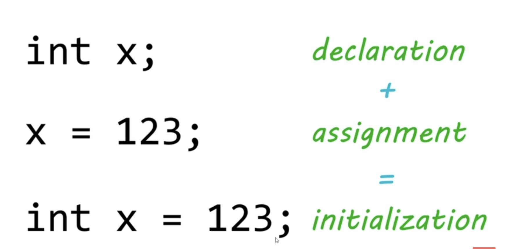

# lesson017. 变量声明、赋值和初始化



### 1. **声明 (Declaration)**

```java
int x;
```

- **含义**：声明一个变量 `x`，类型为 `int`。此时，`x` 仅被声明，但未赋予任何值。
- **作用**：告诉编译器要为 `x` 预留内存空间，但该空间尚未存储具体数据。

------

### 2. **赋值 (Assignment)**

```java
x = 123;
```

- **含义**：给已经声明的变量 `x` 赋值为 `123`。此时，`x` 的内存空间中存储了整数 `123`。
- **作用**：将一个值存储在已经声明的变量中。

------

### 3. **初始化 (Initialization)**

```java
int x = 123;
```

- **含义**：在声明变量的同时为其赋初始值。变量 `x` 被声明为 `int` 类型，并立即赋值为 `123`。
- **作用**：将声明和赋值合并为一步完成，这种方式通常称为 **初始化**。

------

### 小结：

- **声明**：只是告诉编译器变量的类型和名称，但没有赋值。
- **赋值**：为已经声明的变量分配一个具体的值。
- **初始化**：在声明变量时同时赋予一个初始值，是声明和赋值的结合。

通过初始化，您可以确保变量在使用前已经有了明确的值，避免使用未初始化变量的错误。