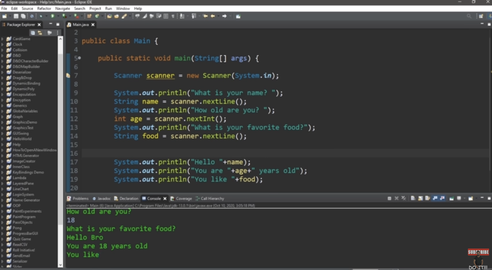

# lesson020. Scanner 类使用中的换行符问题



### **问题分析：为什么不会要求输入最喜欢的食物？**

在这段 Java 代码中，我们遇到一个经典的 `Scanner` 类使用问题，**导致程序跳过了对“最喜欢的食物”的输入**。这是因为 `nextInt()` 和 `nextLine()` 的组合使用方式有一些细节问题。

#### **问题的根源：**

1. 在代码中，`scanner.nextInt()` 用于读取整数（用户的年龄）。
2. 当 `nextInt()` 读取完整数后，它**不会消耗换行符**（`\n`），因此换行符仍然留在输入缓冲区中。
3. 接下来，`scanner.nextLine()` 试图读取一行字符串，但由于缓冲区中已经有一个换行符（来自 `nextInt()`），它会**立即读取到这个换行符**，导致程序直接跳过了 “What is your favorite food?” 的输入。

#### **实际发生的情况：**

- 用户输入年龄，如 `25`，然后按下 **Enter**。`nextInt()` 读取了 `25`，但 **Enter** 键产生的换行符留在了输入缓冲区。
- 当程序执行 `nextLine()` 时，它读取了这个换行符，导致 `food` 变量被赋值为空字符串，程序跳过了对食物的提问。

------

### **解决方案：**

在调用 `nextInt()` 之后，**添加一次** `scanner.nextLine()` 来清除输入缓冲区中的换行符。

#### 修正后的代码：

```java
import java.util.Scanner;

public class Main {
    public static void main(String[] args) {
        Scanner scanner = new Scanner(System.in);

        System.out.println("What is your name? ");
        String name = scanner.nextLine();

        System.out.println("How old are you? ");
        int age = scanner.nextInt();

        // 清除换行符
        scanner.nextLine();  // 这行代码清空缓冲区中的换行符

        System.out.println("What is your favorite food?");
        String food = scanner.nextLine();

        System.out.println("Hello " + name);
        System.out.println("You are " + age + " years old");
        System.out.println("You like " + food);
    }
}
```

#### **解释：**

- 在读取 `age` 后，添加了 `scanner.nextLine()`，用于清空由 `nextInt()` 留在输入缓冲区的换行符，这样后续的 `nextLine()` 就能正常读取用户输入的字符串。

------

### **小结文档**

#### `Scanner` **类使用中的换行符问题**

##### **问题概述：**

在使用 `Scanner` 类时，如果在读取整数或浮点数（如 `nextInt()` 或 `nextDouble()`）后紧接着使用 `nextLine()` 读取一行文本，可能会导致程序跳过对字符串输入的提问。这是因为 `nextInt()` 等方法不会消耗输入中的换行符，导致 `nextLine()` 直接读取到这个换行符，而不是用户的输入。

##### **问题原因：**

- `nextInt()` 读取整数后，用户按下 **Enter** 键生成的换行符（`\n`）会留在输入缓冲区中。
- 当程序执行 `nextLine()` 时，它会立即读取到这个换行符，导致跳过对字符串输入的提问。

##### **解决方法：**

在调用 `nextInt()` 或 `nextDouble()` 等方法之后，添加一次 `scanner.nextLine()` 来清除输入缓冲区中的换行符。

##### **示例代码：**

```java
int age = scanner.nextInt();
scanner.nextLine();  // 清除换行符，确保后续的 nextLine() 能正常工作
String food = scanner.nextLine();
```

##### **总结：**

- 要在使用 `nextInt()` 或 `nextDouble()` 等方法后，进行 `nextLine()` 的输入时，务必在 `nextInt()` 或 `nextDouble()` 后调用一次 `nextLine()` 来清除换行符，避免程序跳过输入。
- 合理处理输入流中的换行符问题，可以确保用户输入的完整性和程序的流畅性。