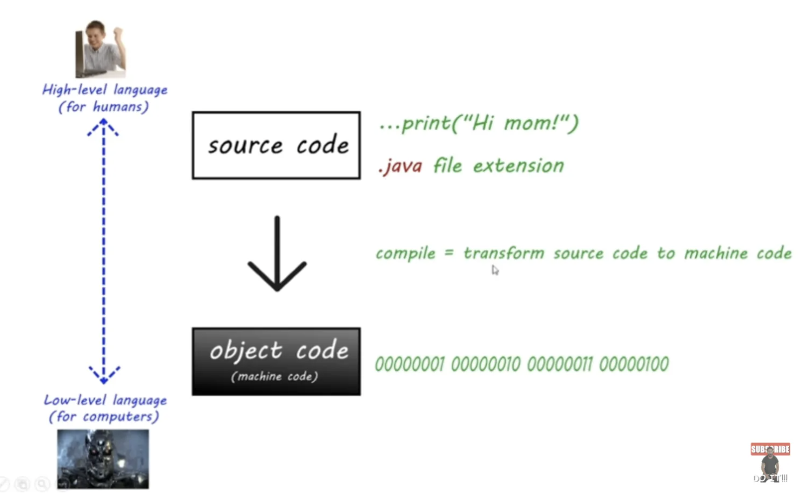

# lesson1. 编译过程简介

编译是将高层次的源代码转换为低层次的机器代码的过程。在 Java 编程中，编译器的主要功能是将人类编写的易于理解的源代码转换为计算机能够执行的机器码。

1. **源代码 (Source Code)**：

- 这是开发者编写的高层次代码，通常以 `.java` 为扩展名，使用的是 Java 编程语言。
- 例如，`System.out.println("Hi mom!")` 就是典型的 Java 源代码。

2. **编译 (Compilation)**：

- 编译器的作用是将源代码转换为机器代码，这个过程称为编译。
- 在 Java 中，编译器首先会将 `.java` 文件编译为字节码（`.class` 文件），然后由 JVM 进一步解释或编译为机器码。

3. **目标代码 (Object Code)**：

- 目标代码（或机器代码）是计算机可以直接理解和执行的低层次语言，通常以二进制（0和1）的形式表示。
- 编译后的机器码可以直接在计算机硬件上运行。

总的来说，编译过程就是将源代码转换为机器代码的一个关键步骤。通过编译，开发者可以将他们编写的高层次语言代码转换为计算机可以执行的低层次语言，从而实现程序的运行。
