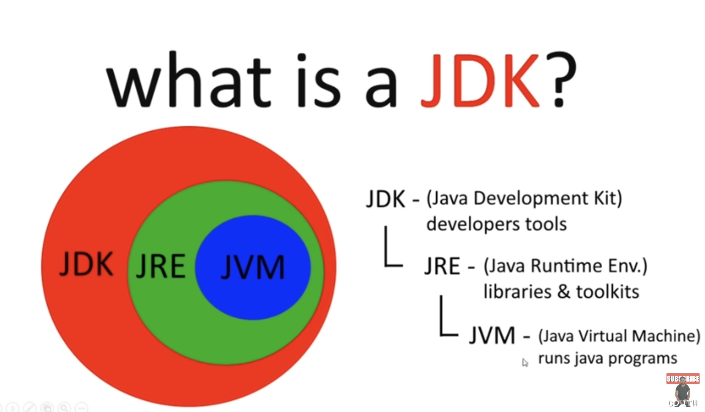

# lesson4. 什么是 JDK？

JDK（Java Development Kit，Java 开发工具包）是用于开发 Java 应用程序的完整工具集。它不仅包含了运行 Java 程序所需要的环境，还提供了开发者编写、编译和调试 Java 程序的工具。

JDK 由以下几个部分组成：

1. **JVM (Java Virtual Machine)**：

- JVM 是 Java 虚拟机，负责运行编译后的字节码。也就是说，JVM 将字节码翻译为机器能够理解的机器码，并执行这些代码。
- JVM 是 Java 跨平台特性的核心，确保了 Java 程序可以在不同的操作系统上运行。

1. **JRE (Java Runtime Environment)**：

- JRE 是 Java 运行时环境，包含了 JVM 及其所需的类库和工具包，用于运行 Java 程序。
- 如果你只需要运行 Java 程序，那么安装 JRE 就足够了。

1. **JDK (Java Development Kit)**：

- JDK 是 Java 开发工具包，包含了 JRE 和用于开发 Java 程序的额外工具，如编译器（`javac`）、调试器等。
- 开发者使用 JDK 来编写、编译和调试 Java 程序。

#### 总结

- **JVM**：运行 Java 字节码的虚拟机。
- **JRE**：包含 JVM 以及运行 Java 程序所需的库和工具。
- **JDK**：包含 JRE 和开发工具，用于开发 Java 程序。

简单来说，JDK 是开发者编写和编译 Java 程序所需的完整工具包，而 JRE 则是运行 Java 程序所需的环境。